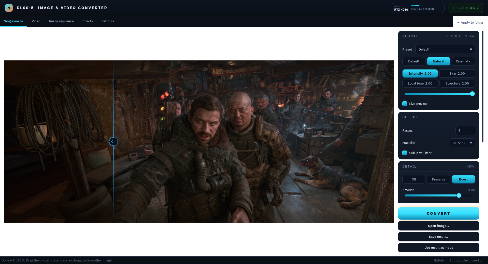
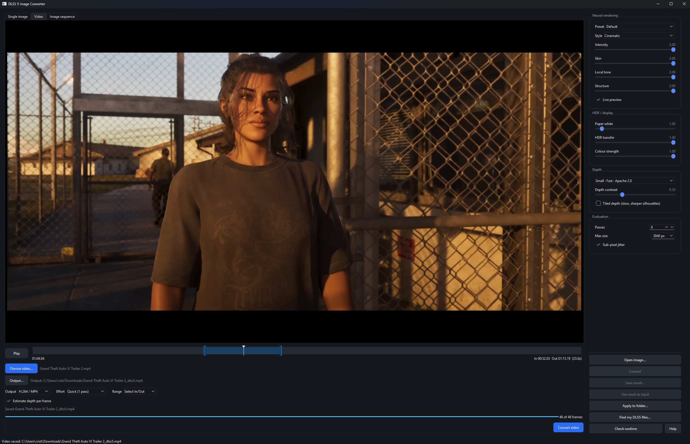
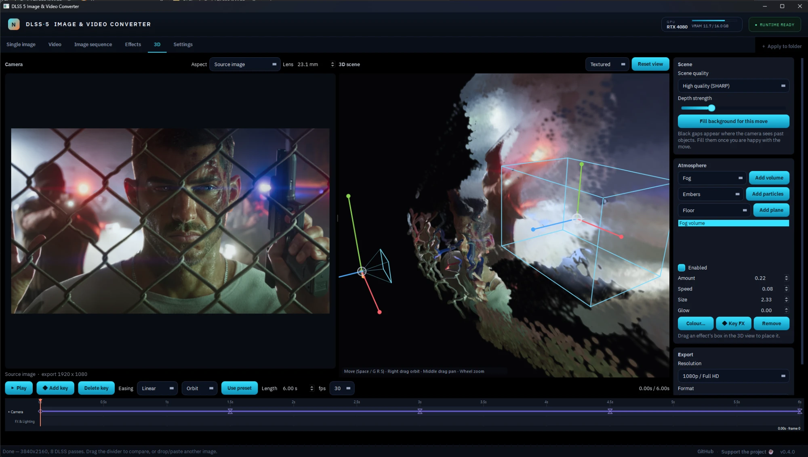
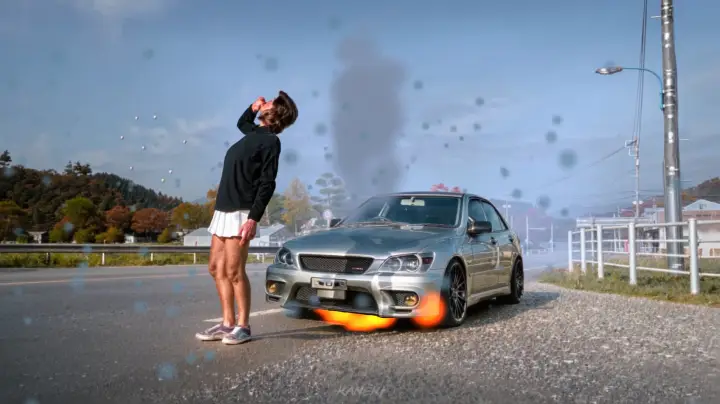
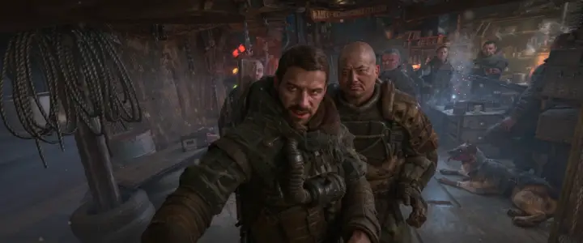
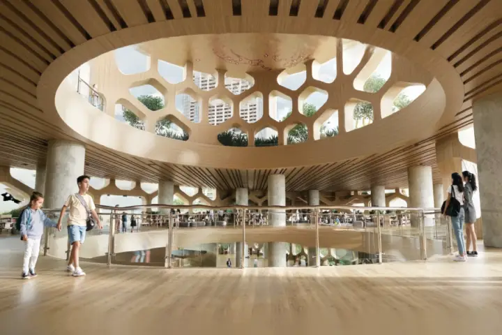
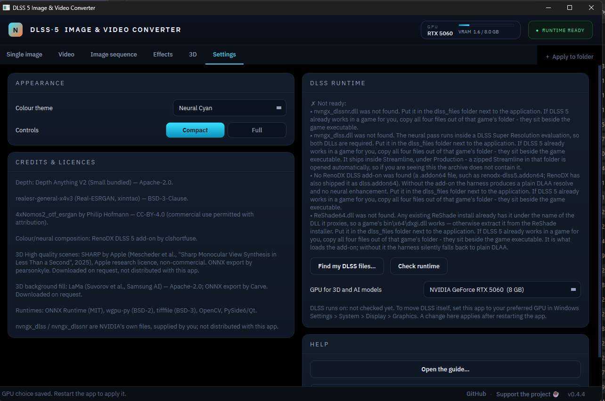

# DLSS 5 Image & Video Converter

Run NVIDIA's DLSS 5 neural renderer over a **still image or a video** instead of a
game frame. Drag and drop, paste (Ctrl+V), or browse. Free to use; please link
here rather than reuploading.

This is the real model — `nvngx_dlssnr.dll` — not a diffusion imitation of the look.

**New in 0.4.0: the 3D tab.** Turn the converted image into a 3D scene, fly a
keyframed camera through it, add fog, smoke, fire and particles, and export a
video up to 4K, including ProRes.

> **Bring your own DLSS files.** None of NVIDIA's binaries are included here, and
> this project will not help you obtain them. You point it at the copies you
> already have.

## Community

Questions, bug reports, results and release news: join the Discord.

[](https://discord.gg/mEfSW3XfNn)

## Buy me a coffee

If this app helped you in any way and you feel like it, you can buy me a coffee.
No pressure, it is free either way. Thank you.

[](https://buymeacoffee.com/criso2hdj)

## See it

The wipe divider — drag it across the image to compare. Everything on one side
is the source, the other the DLSS 5 neural pass. The Before/After labels stay
pinned to the frame corners as you zoom.




**Ultra Detail** rebuilds the image at a much larger size, running the neural
pass over the picture in overlapping tiles and merging them, so detail goes past
what a single pass can hold. Turn on AI upscale and it reconstructs real texture
before the neural pass, then grafts that texture back so anti-aliasing cannot
erase it. The result is a genuinely huge image, saved as PNG, JPEG or TIFF.


The output is large. A 4K source at Ultra becomes tens of thousands of pixels on
the long edge:


**Compare styles** converts the image as both Natural and Cinematic at once, so
you choose between them instead of guessing. Two panes, or three with the source
alongside — every pane shares one zoom and pan.


**Video**, with audio. Scrub and play the clip, set In/Out on the timeline
(scroll to zoom it), and export H.264/MP4 hardware-encoded — the format every
editor takes.



**3D.** The converted image becomes a Gaussian-splat scene. Direct a camera
through it with keyframes, place volumetric fog and particles with gizmos, and
export the shot. The camera view on the left is exactly what gets exported; the
scene view on the right shows the camera, its path and every effect in 3D.



Three shots made in the 3D tab (click for the full clip):

[](app_images_examples/3d/car_smoke_fire_snow.mp4)

[](app_images_examples/3d/metro_interior_scope.mp4)

[](app_images_examples/3d/atrium_architecture.mp4)

**Depth mask**, estimated the moment you open an image, so you can judge it —
and tune its contrast live — before spending a DLSS pass. Near is red.


More, in [`app_images_examples/`](app_images_examples/) and the
[wiki tour](https://github.com/criso2hd-alt/DLSS5-Image-Converter/wiki/Tour):
colour grading, the difference view, full-resolution zoom, folder batches,
image sequences, and "Find my DLSS files".

---

## How it works

`nvngx_dlssnr.dll` is not a standalone image model. It is an NGX snippet that the
RenoDX ReShade add-on injects into a DLSS Super Resolution evaluation. So this app
does not "call DLSS 5" — it **fabricates a convincing DLAA frame** out of one still
image and lets the add-on do its thing.

| DLSS input | Game source | Here |
| ---------- | ----------- | ---- |
| Colour | backbuffer | your image, linearised to RGBA16F |
| Depth | hardware depth buffer | Depth Anything V2, reversed-Z |
| Motion vectors | velocity buffer | zeros — nothing moved |
| Jitter | sub-pixel projection | optional Halton sub-pixel resample |

The depth mapping is the load-bearing trick, and it is a lucky one. Games almost
universally use reversed-Z with an infinite far plane: near objects at 1.0, far at
0.0. Depth Anything V2 emits normalised inverse relative depth — near at 1.0, far at
0.0. Same curve. No reprojection, no metric depth, no camera.

The harness runs a hidden 64×64 swapchain and presents once per evaluation, which
turns out to be enough for ReShade to attach and load the add-on in a **headless**
process. That was the open question the whole project rested on.

## Requirements

- Windows 11, an **RTX** GPU (DLSS is required, so this is not optional)
- Your own copies of:

| File | Where it comes from |
| ---- | ------------------- |
| `nvngx_dlssnr.dll` | your own copy — RTX 40-series needs the patched build |
| `nvngx_dlss.dll` | a Streamline `Production` folder |
| `renodx-dlss5.addon64` | the RenoDX DLSS 5 add-on |
| `dxgi.dll` | ReShade. Already have it in a game? Copy that game's `bin\x64\dxgi.dll` — no need to touch the installer. |

**Easiest: click "Find my DLSS files…" in the app.** It searches your Steam
libraries, Downloads and Documents, and copies the four files in for you.
Nothing is downloaded — it only looks at files already on your machine.

It prefers a folder that has a **complete matched set**, because mixing a
runtime from one source with an add-on from another is a common way to get
`NR is unavailable in this session`. The one exception is the add-on itself: the
newest one found anywhere wins, since games keep whichever build was current
when they were modded, and an out-of-date add-on makes the neural pass silently
not run.

**Or by hand — if DLSS 5 already works in a game for you, copy all four files
out of that game's folder.** They sit beside the game executable, usually in `bin\x64`. A set
already running on your card is a set your GPU, your driver and the add-on have
all accepted, which saves guessing about versions — and keeping the four
together matters, since mixing a runtime from one source with an add-on from
another is a common way to get `NR is unavailable in this session`.

That is also the answer when the runtime check shows `dlssnr_module_loaded: 0`
while every other line reads `1`. The file is present and found; the add-on
refused it.

### Two GPUs

On a PC with more than one GPU (a laptop with an external card, for example),
**Settings > DLSS runtime** shows **GPU for 3D and AI models**. It picks where
the 3D view, SHARP, the background fill, depth and AI upscale run. Leave it on
Automatic to use the same card as DLSS, so everything shares one GPU's memory.
The GPU readout in the top right shows the card in use. A change applies after
restarting the app.



DLSS itself follows Windows: set `DLSS5Converter.exe` to your preferred GPU in
**Windows Settings > System > Display > Graphics**. With a single GPU the
option is hidden, since there is nothing to choose.

## Install (portable)

1. Download the zip from [Releases](../../releases) and unpack it anywhere.
2. Put your four files in `dlss_files\`.
3. Run `DLSS5Converter.exe`.

First launch downloads **PyTorch** (~1.8 GB, from `download.pytorch.org`) and a
**Depth Anything V2** model (~400 MB, from `huggingface.co`), each with a progress
bar showing megabytes, rate and time remaining. Both land in folders beside the exe
and are kept.

```
DLSS5Converter.exe
dlss_files\   your own DLSS 5 binaries    <- you fill this
models\       depth weights               <- downloaded on first launch
pytorch\      PyTorch                     <- downloaded on first launch
output\       converted images
engine\       the DLSS harness
```

Click **Check runtime**. You want all of this:

```
adapter: NVIDIA GeForce RTX 4080
dlss_available: 1
needs_driver_update: 0
neural_addon_loaded: 1
reshade_proxy_loaded: 1
dlssnr_module_loaded: 1
```

If the first three are 1 and `neural_addon_loaded` is 0, DLSS is working and the
neural pass is not. **You still get a picture** — a plain DLAA resolve that looks
like a mild sharpen — which is the single most confusing failure this tool has.
Check this before anything else.

## Using it

Depth is estimated as soon as you open an image, so the **Depth mask** view is
available before you spend a DLSS pass. Its contrast slider redraws live, because
contrast is applied to the finished depth array rather than fed back into the model.

**Live preview** re-runs DLSS when a slider settles. Budget about four seconds per
change — that is not render cost. The add-on reads its settings once at startup, so
every change is a fresh process, and ~3.5 s of the four is NGX and add-on
initialisation regardless of image size. Depth is cached across runs, and a slider
drag is debounced into a single evaluation.

Sliders map onto the add-on's own controls: Intensity, Skin, Local Tone, Structure
(0–2), plus Preset/Style and an HDR group — Paper White (0–16), HDR Transfer (0–1),
Colour Strength (0–1) — for HDR and OLED displays.

### Colour, and looking closely

**Colour** in the bottom row opens exposure, contrast, saturation and vibrance,
applied to the finished image. It is live — around 27 ms a redraw — because it
runs *after* the neural pass rather than before it. Grading the input would
change what the model sees, since the pass reasons about light transport, and
would cost a full re-evaluation for every nudge.

All of it happens in linear light. Vibrance scales its boost by how colourful a
pixel already is, so skies and materials lift while skin mostly does not — reach
for that before saturation on anything with a face in it.

The result view shows the image at **full resolution**, so zooming in reveals
the real output — pore, weave and reflection detail — not a magnified preview.
While a colour slider is actually moving it drops to a fast 1200 px stand-in to
stay responsive (grading a 4K frame live is ~1.5 s), then sharpens back to full
resolution the moment the slider settles. The zoom you set to inspect something
is held across that swap, and across a live-preview re-convert, so you stay on
the same spot.

**Wheel zooms** about the cursor, **right-drag pans**, double-click fits again.
Left-drag still moves the comparison divider. Worth using — at 6K the things
this tool changes are invisible at fit-to-window.

### Compare styles

**Compare styles**, next to Difference, converts the image once as *Natural* and
once as *Cinematic* and puts both on screen. There are only two styles, so this
is the whole choice rather than a sample of it.

Side by side by default, because choosing between two pictures is a question
about the whole frame; switch to **Wipe** if you would rather slide one over the
other to spot a specific change. Either way every pane shares one zoom and one
pan — they are not kept in step, they are the same numbers drawn twice, so they
cannot drift apart. Scroll to zoom, right-drag to pan, double-click to fit.

**Two panes or three**, and a dropdown over each one choosing what it shows:
*Original*, *Natural* or *Cinematic*. Three panes default to the source next to
both styles, which answers a different question — not "which style" but "is the
pass helping at all". Every pane gets the same colour grade, so the only
difference on screen is the one being judged.

**Keep Natural** / **Keep Cinematic** makes that version the result, so
`Save result…` exports it, and sets the style in the sidebar so the next
conversion and any folder batch use it too.

The source pane is free. The two styles cost a conversion each, because the
add-on reads its configuration once when it starts and a style change needs a
new harness. Depth is estimated once and
shared. Measured at 1920 px, 8 passes, on an RTX 4080: 7.9 s for depth, then
5.1 s per style — 18 s in total.

Worth knowing how much the choice matters. On the sample portrait, against the
source image:

| | mean difference |
| - | --------------- |
| Natural vs source | 0.0105 |
| Cinematic vs source | 0.0143 |
| **Natural vs Cinematic** | **0.0140** |

The gap between the two styles is as large as the entire effect of the neural
pass. Picking one is not a detail.

### A second pass

**Use result as input** feeds the finished image back in, with the colour grade
baked and depth re-estimated from the new picture. The intermediate is written
to the scratch folder as `name_pass2.png`, `name_pass3.png` and so on, so you
can find it.

It compounds. Measured on a render at full strength: pass one moves the image
0.057 from the source, and pass two moves it a further 0.035 — roughly as much
again. That is what makes it worth having on a flat render, and it is also the
quickest way to make a portrait look plastic. **Lower the strengths for the
second pass** rather than repeating the first.

### A folder at a time

**Apply to folder…** runs a whole folder with whatever is in the sidebar — neural
strengths, depth settings, passes, size and the colour grade. Tune them on one
image first; that image is your reference, and the rest of the folder gets the
same treatment.

It is a dialog rather than a third tab because batch is not really a separate
mode — it is "do that again, to these" — so it belongs to the page where the
settings were chosen and it goes away afterwards.

One bad file does not stop the run: it is reported and skipped. **Skip images
already converted** is on by default, so an interrupted batch can simply be
started again. The harness is kept alive between images and restarted only when
the frame size changes, so a folder of renders at one resolution pays the ~3.5 s
start-up once.

Use the **Image sequence** tab instead for animation — that keeps frames
consistent with one another and can take your renderer's depth pass.

### Video

The **Video** tab, between Single image and Image sequence, converts a clip and
keeps its audio. A video here is not run like a game — each frame is an
independent single-image conversion, DLSS's history reset between frames, so
nothing smears from one frame into the next. That independence is why it stays
stable: a test render measured **−4%** frame-to-frame change versus the source,
i.e. the neural pass adds no flicker.

The same sidebar controls apply — neural strengths, style, colour — plus:

- **Output codec.** **H.264/MP4** by default, hardware-encoded on your GPU
  (NVENC) — the one format every editor and player ingests. H.265/MP4 for
  smaller files; ProRes 422 HQ or ProRes 4444 (10-bit .mov) as editing masters;
  VP9/WebM for web upload, *not* editing (editors do not import WebM cleanly).
  Every format encodes at visually lossless constant quality.
- **Effort.** *Quick* (1 pass) or *Quality* (4 passes). The neural pass is ~0.1 s
  a frame either way, so a 10-second clip converts in well under a minute.
- **Range.** Convert the first few seconds to check the look before committing to
  the whole thing.

Audio is copied from the source unchanged and muxed back in, so the result keeps
its sound and stays in sync. Video support (PyAV, ~35 MB) downloads on first use
of this tab, like PyTorch — nothing is bundled.

### Image sequences

The **Image sequence** tab converts a rendered sequence frame by frame. Pick the
first frame and the rest are found by their trailing counter — matching prefix,
matching padding width, so two renders in one folder do not interleave.

**Give it your renderer's depth pass.** Pick the first frame of a depth sequence
and Depth Anything is bypassed entirely. This is what makes a sequence look
steady: estimated depth wobbles slightly from frame to frame and the neural pass
follows that as flicker, while a depth pass out of Blender or Maya is
geometrically exact and does not move at all. There is an invert toggle, because
renderers disagree about which way up depth goes and it cannot be inferred — a
Blender mist pass is near-dark, so tick it, and check the result looks right.

Every frame resets DLSS's temporal history. Motion vectors are zero, so carrying
accumulation between two genuinely different frames would drag the previous
image into this one wherever the scene moved. Consistency comes from identical
settings and stable depth, not from shared history — and it is exact: identical
inputs produce bit-identical outputs.

The whole sequence runs on **one** harness. Start-up is ~3.5 s and dominates a
single conversion, so a sequence pays it once: five 640×360 frames take 6.2 s in
total, 1.23 s each, against roughly 4 s each if every frame started its own.

Output is a PNG sequence, plus an MP4 if you want one. That is encoded with mp4v
rather than H.264, because OpenCV ships no H.264 encoder — the frames are always
written, so re-encode them with anything you prefer. All frames must be the same
size: one harness means one set of NGX buffers.

### 3D scenes

The **3D** tab works on the image you just converted on the Single image tab.
Convert, switch tabs, and the scene is built from the result and its depth. It
never reprocesses the image, so every control responds straight away.

**Scene quality.** *Standard* builds the scene from the app's own depth map, with
nothing to download. *High quality* uses Apple's SHARP model, which predicts the
3D scene itself: much cleaner around people and objects, more solid from other
angles, and it already fills in a little of what sits behind each edge. It is a
one-time 1.3 GB download (research licence, see Credits) and takes about 20
seconds per image.

**The two views.** The camera view shows exactly the exported frame. The 3D scene
view is a free view of the whole scene: right-drag orbits, middle-drag pans,
the wheel zooms. It draws the camera, its path and every effect.

**Camera.** Start from a preset (Orbit, Drift, Push in, Pull out, Vertigo, Static)
and it becomes ordinary keyframes you can edit. Move and rotate the camera with
the gizmo in the scene view (Space cycles Move, Rotate and Scale; G, R and S jump
straight there). Keyframes show their easing on the timeline the way After
Effects does: a diamond for linear, an hourglass for eased, a square for hold.
**Lens** sets the focal length and keys it at the playhead, so two keys with
different lenses make an animated zoom.

**Aspect.** Pick the shape of the video: source, 16:9, 9:16 vertical, 4:3, 1:1,
4:5, 1.85:1 flat, 2.39:1 CinemaScope or 2.76:1 Ultra Panavision. The aspect crops
the camera's frame rather than changing the camera, and the export follows video
standards for the chosen resolution (1080p scope is 1920x804, vertical is
1080x1920).

**Filling what the camera reveals.** Move the camera sideways and it sees behind
things the photo never showed. *Fill background for this move* walks the camera
along its path, finds every gap, and paints it in as part of the scene. It
understands the scene as surfaces: the road carries on under a car, the wall
carries on behind a head. With the optional LaMa model (207 MB) the fill
continues real structure; it runs on the GPU. Run it again after changing the
camera move.

**Effects.** *Add effect* offers volumes (fog, smoke, fire, cloud, god rays,
raymarched on the GPU and stopping softly at surfaces), particles, lightning, and
collision planes. Each effect has its own settings, and **every setting has a
keyframe diamond**: click it to key the value at the playhead, and once a
setting is animated, changing it keys it again, the way After Effects does.
Untick an effect to switch it off, or click its eye to hide just its gizmo when
the 3D view gets crowded.

**Particles.** Embers, dust, snow, rain, smoke, fire and clouds, each drawn its
own way. Embers flash white hot, cool through orange and red, then drift down as
grey ash. Fire is flickering flame tongues that burn out into smoke. Smoke
billows and takes the scene's light. Rain falls as streaks and splashes into
ripples where it lands. Glowing particles add light where they overlap, and fast
ones streak like a camera shutter. Particles collide with the floor and walls:
smoke pools along the ground, embers and snow bounce. The photo decides what "up"
is, so you choose each emitter's direction. Add your own **Floor**, **Ceiling**
or **Wall** planes when the depth came out tilted; a floor shows a gravity arrow
and tilts "up" for every particle with it.

**Lightning.** Place a lightning target and a forked bolt strikes it, flickers,
and lights up the whole frame. Random strikes come at irregular moments (the
same ones on every playback); set them to 0 and press *Strike at playhead* to
place every strike yourself. Placed strikes show as bolts on the timeline. Hide
the bolt to keep only the flash, like lightning out of shot.

**Wet surfaces.** Wetness darkens the scene and makes the ground shine with
reflections of what is above it, strongest at low angles like real wet asphalt.
Puddles turn patches of the ground into mirrors, rain ripples ring across them,
and all of it can be keyframed, so the ground can dry or flood during a shot.
Reflections come from what is in frame; *Mirror puddles* fills the rest by
mirroring the image across the horizon.

**Export.** 720p up to 4K, in H.264, H.265, ProRes 422 HQ, ProRes 4444 or VP9, at
visually lossless quality. Video support downloads by itself the first time you
export, if it is not there yet.

Needs a GPU with Vulkan or DirectX 12 (any recent NVIDIA, AMD or Intel card).

### Detail recovery and Boost

**Preserve** restores the source image's real high-frequency texture after the
neural pass. **Boost** instead enlarges the source, sharpens it, runs DLSS at that
working resolution, then downsamples to the native size. The selectable factors
are 2×, 4× and 8×; they process 4, 16 and 64 times as many pixels respectively.

Boost has no arbitrary 8K cap and never silently substitutes a lower factor. It
checks the NVIDIA GPU's currently free VRAM after depth estimation, keeps a small
safety reserve, and refuses a run that is likely to exhaust it with a message that
shows the requested working size and available memory. If the driver query is not
available, D3D12 remains the authority and the conversion is allowed to try.

There is one hardware-API limit: a D3D12 texture can be at most 16,384 pixels on
either side. Consequently a 3840 px source can use 4× (15,360 px) but not 8×;
8× is available for sources whose longest edge is at most 2048 px. Lower **Max
size** first when you deliberately want a higher Boost multiplier.

The installed DLSS runtime can impose a lower feature limit. On the reference
runtime, 8× at a 960 px source succeeds at a 7680 px working edge, while a
10,240 px request is rejected by NGX as an invalid feature parameter despite
ample VRAM. The app lets the runtime make that decision and reports the exact
attempted size; it never hides the rejection by falling back to another factor.
In the matched architectural test, 8× was clean and closer to the source, but
softer than 4×—treat it as an advanced alternative, not an automatic quality tier.

### Working above 4K

**Max size** under Evaluation is the longest edge sent to DLSS — the resolution
the neural pass runs at. Anything larger is downscaled first, so leaving it at 4K
silently shrinks a 6000 px render.

It is not the export setting. **Save result…** asks for an output size of its
own: native by default, with presets for 1.5x/2x/3x/4x and for a fixed long edge,
or type a width and the height follows. That is plain resampling — Lanczos,
computed in linear light, not a second AI pass — so it fits a delivery spec but
cannot add detail. Detail comes from Max size.

The default is 4K because that is the size NVIDIA validated, not a limit of the
tool. Measured here on a 16 GB RTX 4080, with the add-on confirming the neural
pass running at full size rather than degrading:

| longest edge | time (4 passes) | VRAM |
| ------------ | --------------- | ---- |
| 3840 | 22 s | 5.2 GB |
| 5000 | 15 s | 5.2 GB |
| 6016 | 20 s | 5.2 GB |
| 7680 | 25 s | 5.3 GB |

VRAM barely moves, because the cost is dominated by fixed NGX and add-on
allocations rather than by the image. Architectural and product renders at
5–6K should just raise this. The field is editable, so an odd size can be typed
in directly.

### HDR

Open a `.jxr` — what Xbox Game Bar and NVIDIA's capture write when you screenshot
an HDR game — and the whole pipeline stays in linear light. `.exr` and `.hdr` are
treated the same way.

This is not a format convenience. DLSS 5's neural pass is built to work in HDR;
that is why the add-on has paper white, HDR transfer and colour sliders at all.
Feeding it a real HDR image is the input the model was designed for, and the
highlights that an SDR screenshot has already thrown away are exactly the ones
it has the most to say about.

What happens where:

| stage | HDR source |
| ----- | ---------- |
| decode | Windows' own JPEG XR codec — no extra download |
| DLSS | linear scRGB, values above 1.0 intact |
| depth | tone mapped copy, because Depth Anything wants a normal picture |
| preview | tone mapped, with the same white point for both halves of the wipe |
| export | `.jxr` or `.exr` keep the range; PNG/TIFF/JPEG tone map rather than clip |

`Save result…` defaults to `.jxr` for an HDR result, and the status bar says
whether the range was kept or tone mapped. Folder batch and image sequences
follow the source: an HDR frame in, an HDR frame out.

Tone mapping is extended Reinhard on luminance, with the white point taken from
the 99.9th percentile rather than the maximum — one specular pixel at 300x
diffuse white should not drag the whole image into the floor.

Nothing here converts to absolute nits. scRGB's 1.0 is diffuse white, and how
bright that ends up is the add-on's paper-white slider, not ours.

### Command line

```powershell
.\.venv-cuda\Scripts\python.exe -m dlss5_converter.pipeline in.jpg out.png `
    --frames 8 --intensity 0.7 --skin 0.5 --tiled-depth
```

## What it is good at

Game screenshots, 3D renders, and CG stills. DLSS 5 was trained to push *rendered*
images towards photoreal, so it has the most to say about images that started out
rendered.

On real photographs it does less, and what it does is more likely to read as
uncanny — the model adds the cues it expects a render to be missing, and a
photograph already has them. Lower **Skin** first when faces go waxy. That is a
property of the model, not a bug in the harness.

## Measured behaviour

Findings from bring-up, measured rather than assumed. Full detail and method in
[ROADMAP.md](ROADMAP.md).

- **The strength knobs go to 2.0**, not 1.0. Output keeps changing all the way up and
  is identical at 3.0. An earlier measurement of 1.0 came from a synthetic test card,
  which stops responding above 1 where a photograph does not.
- **`NRStyle` is a large effect** — Cinematic lands ~50% further from the source than
  Natural at matched strengths.
- **`NRPreset` appears inert** with upscaling off: all four presets measured
  bit-identical, though the add-on echoes the value back in its log. It most likely
  selects a Super Resolution preset that a DLAA-only path never reaches.
- **`NeuralUplift=0` is a clean off switch**, bit-identical to a plain DLAA resolve.
- **Passes can be 1 again.** The add-on installs its NGX hooks from ReShade's
  frame callback and only applies the neural pass from the *second* intercepted
  evaluation, so a one-pass run used to come back a plain DLAA resolve with no
  warning. The harness now presents a frame and runs two throwaway evaluations
  before the counted ones, so every pass count works. More passes still help a
  little (0.0530 at one pass, 0.0547 at eight, on the same image).
- Settings are read **once, at add-on load**. Flipping the ini mid-run does nothing.

## Build from source

```powershell
.\scripts\setup.ps1 -Cuda      # Python 3.12 venv; -Cuda gets GPU depth estimation
.\scripts\build_native.ps1     # clones the NGX SDK, builds dlss5_eval.exe
.\scripts\run.ps1
```

Needs Python 3.12, git, and Visual Studio with the C++ workload. CMake is found
inside Visual Studio if it is not on PATH. The SDK clone is blobless and sparse
(~85 MB rather than ~1 GB).

`.\scripts\build_release.ps1` produces the portable folder. It **refuses to finish**
if any `nvngx_*.dll`, `*.addon64` or `dxgi.dll` has ended up inside the application,
so "bring your own files" is a property of the build rather than something to
remember. `dlss_files`, `models`, `pytorch` and `output` survive a rebuild.

Tests: `.\.venv-cuda\Scripts\python.exe -m pytest`

## Layout

```
dlss5_converter/     Python: GUI, depth, contract construction
  contract.py        the interesting part — photo to DLAA frame
  runtime.py         locating the user's binaries, and the add-on's ini
  evaluator.py       line protocol to the harness
  pipeline.py        the whole conversion, runnable headless
  bootstrap.py       first-launch runtime download
native/dlss5_eval/   C++: D3D12 + NGX. The only NVIDIA-facing code.
scripts/             setup / build / run
```

Python never links against NGX. The harness is a plain CLI that reads raw binary
planes and writes one back, so it can be run and debugged by hand, and a crash
inside DLSS cannot take the app down with it.

## Trust

Reasonable question for a random executable:

- The source is here. Build it yourself with the two scripts above.
- **No NVIDIA binaries are bundled and there is no downloader for them.**
- The app talks to exactly three hosts, all HTTPS, all first-run downloads:
  `download.pytorch.org`, `huggingface.co`, and `pypi.org` (the video
  component). Nothing else phones home from our code, and there is no telemetry.
- Our code **never writes to the registry**; the only key it reads is your Steam
  install path, to find your games for *Find my DLSS files*.
- Roughly 2,500 lines of Python and one ~600-line C++ file.

**[SECURITY.md](SECURITY.md)** answers the antivirus warnings and the registry
questions in full — including why unsigned builds get flagged, exactly which
registry keys are read (and by what — Windows' TLS checks and NVIDIA's own NGX
updater, not our code), and how to verify all of it yourself.

## Something not working?

The **Help** button in the app, beside Check runtime, opens
[**the wiki**](https://github.com/criso2hd-alt/DLSS5-Image-Converter/wiki) —
the same guide as [TROUBLESHOOTING.md](TROUBLESHOOTING.md), kept current
between releases. A failed conversion offers it directly, and so does Check
runtime when it finds a problem.

Start with:

```powershell
DLSS5Converter.exe --selftest
```

The report is saved as `report.txt` next to the exe.

That runs a real conversion end to end and prints your GPU, driver, add-on
version and what the add-on said. Most questions answer themselves from it.

There is a Blender test scene in [`blender/`](blender/) that renders matched
beauty and depth sequences for trying out sequence mode.

## Support

This is free, and staying free. If it saved you time and you feel like it, there
is a **Sponsor** button at the top of the repository. Entirely optional — bug
reports and screenshots of what you made are worth just as much.

## Credits

This app stands on other people's work:

- **Depth Anything V2** (Yang et al.): depth estimation. Apache-2.0 (Small, bundled).
- **RenoDX DLSS 5 add-on** by clshortfuse: the colour and neural composition the
  harness drives.
- **SHARP** by Apple ("Sharp Monocular View Synthesis in Less Than a Second",
  Mescheder et al., 2025): the optional *High quality* 3D scenes. Apple's model
  licence is **research / non-commercial**. The weights are downloaded on request
  from a community ONNX export by
  [pearsonkyle](https://huggingface.co/pearsonkyle/Sharp-onnx) and are not
  distributed with this app. Original release:
  [apple/ml-sharp](https://github.com/apple/ml-sharp).
- **LaMa** (Suvorov et al., Samsung AI): background fill in the 3D tab.
  Apache-2.0; ONNX export by [Carve](https://huggingface.co/Carve/LaMa-ONNX),
  downloaded on request.
- The AI upscale models listed on the Settings page, with their own licences.
- Runtimes: ONNX Runtime (MIT), wgpu-py (BSD-2), PySide6 / Qt, OpenCV, tifffile.

NVIDIA's `nvngx_dlss` / `nvngx_dlssnr` files are NVIDIA's own and are supplied by
you; this project does not distribute them.

## Licence

**Source-available, not open source.** See [LICENSE](LICENSE).

Free to use, personally or commercially. The source is here so you can read it,
audit it, and build it yourself.

Please do not redistribute it — no mirrors, reuploads, repacks, or packaged
builds — and do not sell it or put it behind a paywall, supporter tier, or ad
gateway. **Send people to this repository instead.** That way everyone gets the
current version, and anyone worried about what an executable does can check the
source it came from.

Nothing here grants any rights to NVIDIA's binaries. `nvngx_dlssnr.dll` is a
leaked pre-release NVIDIA file; this repository does not ship it, reference it
by hash, or help anyone acquire it.
