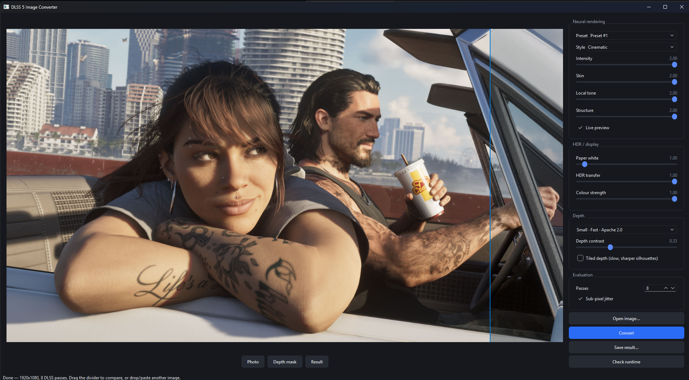
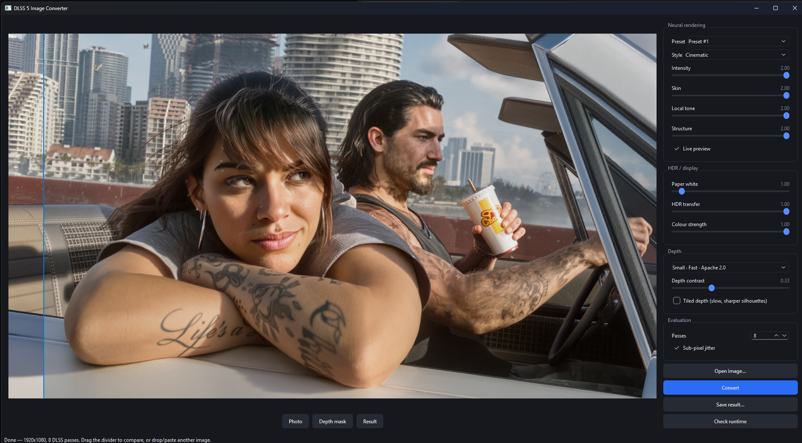
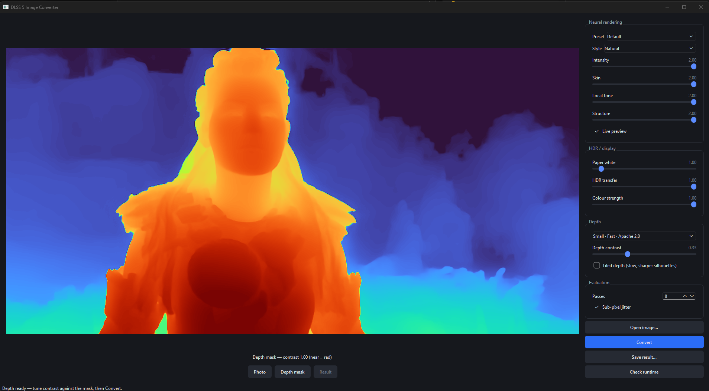

# DLSS 5 Image Converter

Run NVIDIA's DLSS 5 neural renderer over a **still image** instead of a game frame.
Drag and drop, paste (Ctrl+V), or browse. Free to use; please link here rather
than reuploading.

This is the real model — `nvngx_dlssnr.dll` — not a diffusion imitation of the look.

> **Bring your own DLSS files.** None of NVIDIA's binaries are included here, and
> this project will not help you obtain them. You point it at the copies you
> already have.

The same frame, before and after. The blue line is the wipe divider — drag it
across the image to compare; everything left of it is the original.

**Before** — divider at the right, so this is almost entirely the source image:



**After** — divider at the left, so this is the DLSS 5 neural pass, at Intensity,
Skin, Local Tone and Structure 2.00, Preset #1, Cinematic, 8 passes:



The controls on the right map straight onto the RenoDX add-on's own.



Depth is estimated the moment you open an image, so you can judge the mask — and
tune its contrast live — before spending a DLSS pass on it. Near is red.

---

## How it works

`nvngx_dlssnr.dll` is not a standalone image model. It is an NGX snippet that the
RenoDX ReShade add-on injects into a DLSS Super Resolution evaluation. So this app
does not "call DLSS 5" — it **fabricates a convincing DLAA frame** out of one still
image and lets the add-on do its thing.

| DLSS input | Game source | Here |
| ---------- | ----------- | ---- |
| Colour | backbuffer | your image, linearised to RGBA16F |
| Depth | hardware depth buffer | Depth Anything V2, reversed-Z |
| Motion vectors | velocity buffer | zeros — nothing moved |
| Jitter | sub-pixel projection | optional Halton sub-pixel resample |

The depth mapping is the load-bearing trick, and it is a lucky one. Games almost
universally use reversed-Z with an infinite far plane: near objects at 1.0, far at
0.0. Depth Anything V2 emits normalised inverse relative depth — near at 1.0, far at
0.0. Same curve. No reprojection, no metric depth, no camera.

The harness runs a hidden 64×64 swapchain and presents once per evaluation, which
turns out to be enough for ReShade to attach and load the add-on in a **headless**
process. That was the open question the whole project rested on.

## Requirements

- Windows 11, an **RTX** GPU (DLSS is required, so this is not optional)
- Your own copies of:

| File | Where it comes from |
| ---- | ------------------- |
| `nvngx_dlssnr.dll` | your own copy — RTX 40-series needs the patched build |
| `nvngx_dlss.dll` | a Streamline `Production` folder |
| `renodx-dlss5.addon64` | the RenoDX DLSS 5 add-on |
| `dxgi.dll` | ReShade. Already have it in a game? Copy that game's `bin\x64\dxgi.dll` — no need to touch the installer. |

**If DLSS 5 already works in a game for you, copy all four files out of that
game's folder.** They sit beside the game executable, usually in `bin\x64`. A set
already running on your card is a set your GPU, your driver and the add-on have
all accepted, which saves guessing about versions — and keeping the four
together matters, since mixing a runtime from one source with an add-on from
another is a common way to get `NR is unavailable in this session`.

That is also the answer when the runtime check shows `dlssnr_module_loaded: 0`
while every other line reads `1`. The file is present and found; the add-on
refused it.

## Install (portable)

1. Download the zip from [Releases](../../releases) and unpack it anywhere.
2. Put your four files in `dlss_files\`.
3. Run `DLSS5Converter.exe`.

First launch downloads **PyTorch** (~1.8 GB, from `download.pytorch.org`) and a
**Depth Anything V2** model (~400 MB, from `huggingface.co`), each with a progress
bar showing megabytes, rate and time remaining. Both land in folders beside the exe
and are kept.

```
DLSS5Converter.exe
dlss_files\   your own DLSS 5 binaries    <- you fill this
models\       depth weights               <- downloaded on first launch
pytorch\      PyTorch                     <- downloaded on first launch
output\       converted images
engine\       the DLSS harness
```

Click **Check runtime**. You want all of this:

```
adapter: NVIDIA GeForce RTX 4080
dlss_available: 1
needs_driver_update: 0
neural_addon_loaded: 1
reshade_proxy_loaded: 1
dlssnr_module_loaded: 1
```

If the first three are 1 and `neural_addon_loaded` is 0, DLSS is working and the
neural pass is not. **You still get a picture** — a plain DLAA resolve that looks
like a mild sharpen — which is the single most confusing failure this tool has.
Check this before anything else.

## Using it

Depth is estimated as soon as you open an image, so the **Depth mask** view is
available before you spend a DLSS pass. Its contrast slider redraws live, because
contrast is applied to the finished depth array rather than fed back into the model.

**Live preview** re-runs DLSS when a slider settles. Budget about four seconds per
change — that is not render cost. The add-on reads its settings once at startup, so
every change is a fresh process, and ~3.5 s of the four is NGX and add-on
initialisation regardless of image size. Depth is cached across runs, and a slider
drag is debounced into a single evaluation.

Sliders map onto the add-on's own controls: Intensity, Skin, Local Tone, Structure
(0–2), plus Preset/Style and an HDR group — Paper White (0–16), HDR Transfer (0–1),
Colour Strength (0–1) — for HDR and OLED displays.

### Colour, and looking closely

**Colour** in the bottom row opens exposure, contrast, saturation and vibrance,
applied to the finished image. It is live — around 27 ms a redraw — because it
runs *after* the neural pass rather than before it. Grading the input would
change what the model sees, since the pass reasons about light transport, and
would cost a full re-evaluation for every nudge.

All of it happens in linear light. Vibrance scales its boost by how colourful a
pixel already is, so skies and materials lift while skin mostly does not — reach
for that before saturation on anything with a face in it.

The preview is graded at 1200 px so the sliders stay responsive on an 8K image;
the saved file is graded at full resolution through the exact transfer curve.

**Wheel zooms** about the cursor, **right-drag pans**, double-click fits again.
Left-drag still moves the comparison divider. Worth using — at 6K the things
this tool changes are invisible at fit-to-window.

### Working above 4K

**Max size** under Evaluation is the longest edge sent to DLSS, and therefore the
size you get back. Anything larger is downscaled first, so leaving it at 4K
silently shrinks a 6000 px render.

The default is 4K because that is the size NVIDIA validated, not a limit of the
tool. Measured here on a 16 GB RTX 4080, with the add-on confirming the neural
pass running at full size rather than degrading:

| longest edge | time (4 passes) | VRAM |
| ------------ | --------------- | ---- |
| 3840 | 22 s | 5.2 GB |
| 5000 | 15 s | 5.2 GB |
| 6016 | 20 s | 5.2 GB |
| 7680 | 25 s | 5.3 GB |

VRAM barely moves, because the cost is dominated by fixed NGX and add-on
allocations rather than by the image. Architectural and product renders at
5–6K should just raise this. The field is editable, so an odd size can be typed
in directly.

### Command line

```powershell
.\.venv-cuda\Scripts\python.exe -m dlss5_converter.pipeline in.jpg out.png `
    --frames 8 --intensity 0.7 --skin 0.5 --tiled-depth
```

## What it is good at

Game screenshots, 3D renders, and CG stills. DLSS 5 was trained to push *rendered*
images towards photoreal, so it has the most to say about images that started out
rendered.

On real photographs it does less, and what it does is more likely to read as
uncanny — the model adds the cues it expects a render to be missing, and a
photograph already has them. Lower **Skin** first when faces go waxy. That is a
property of the model, not a bug in the harness.

## Measured behaviour

Findings from bring-up, measured rather than assumed. Full detail and method in
[ROADMAP.md](ROADMAP.md).

- **The strength knobs go to 2.0**, not 1.0. Output keeps changing all the way up and
  is identical at 3.0. An earlier measurement of 1.0 came from a synthetic test card,
  which stops responding above 1 where a photograph does not.
- **`NRStyle` is a large effect** — Cinematic lands ~50% further from the source than
  Natural at matched strengths.
- **`NRPreset` appears inert** with upscaling off: all four presets measured
  bit-identical, though the add-on echoes the value back in its log. It most likely
  selects a Super Resolution preset that a DLAA-only path never reaches.
- **`NeuralUplift=0` is a clean off switch**, bit-identical to a plain DLAA resolve.
- **`--frames 1` silently skips the neural pass entirely.** The add-on installs its
  NGX hooks on the first evaluate, so that one cannot be intercepted. Use 2 or more;
  the default is 8, and the result stops changing by about 8.
- Settings are read **once, at add-on load**. Flipping the ini mid-run does nothing.

## Build from source

```powershell
.\scripts\setup.ps1 -Cuda      # Python 3.12 venv; -Cuda gets GPU depth estimation
.\scripts\build_native.ps1     # clones the NGX SDK, builds dlss5_eval.exe
.\scripts\run.ps1
```

Needs Python 3.12, git, and Visual Studio with the C++ workload. CMake is found
inside Visual Studio if it is not on PATH. The SDK clone is blobless and sparse
(~85 MB rather than ~1 GB).

`.\scripts\build_release.ps1` produces the portable folder. It **refuses to finish**
if any `nvngx_*.dll`, `*.addon64` or `dxgi.dll` has ended up inside the application,
so "bring your own files" is a property of the build rather than something to
remember. `dlss_files`, `models`, `pytorch` and `output` survive a rebuild.

Tests: `.\.venv-cuda\Scripts\python.exe -m pytest`

## Layout

```
dlss5_converter/     Python: GUI, depth, contract construction
  contract.py        the interesting part — photo to DLAA frame
  runtime.py         locating the user's binaries, and the add-on's ini
  evaluator.py       line protocol to the harness
  pipeline.py        the whole conversion, runnable headless
  bootstrap.py       first-launch runtime download
native/dlss5_eval/   C++: D3D12 + NGX. The only NVIDIA-facing code.
scripts/             setup / build / run
```

Python never links against NGX. The harness is a plain CLI that reads raw binary
planes and writes one back, so it can be run and debugged by hand, and a crash
inside DLSS cannot take the app down with it.

## Trust

Reasonable question for a random executable:

- The source is here. Build it yourself with the two scripts above.
- **No NVIDIA binaries are bundled and there is no downloader for them.**
- The app talks to exactly two hosts, both on first launch: `download.pytorch.org`
  and `huggingface.co`. Nothing else phones home, and there is no telemetry.
- Roughly 2,500 lines of Python and one ~600-line C++ file.

## Licence

**Source-available, not open source.** See [LICENSE](LICENSE).

Free to use, personally or commercially. The source is here so you can read it,
audit it, and build it yourself.

Please do not redistribute it — no mirrors, reuploads, repacks, or packaged
builds — and do not sell it or put it behind a paywall, supporter tier, or ad
gateway. **Send people to this repository instead.** That way everyone gets the
current version, and anyone worried about what an executable does can check the
source it came from.

Nothing here grants any rights to NVIDIA's binaries. `nvngx_dlssnr.dll` is a
leaked pre-release NVIDIA file; this repository does not ship it, reference it
by hash, or help anyone acquire it.
